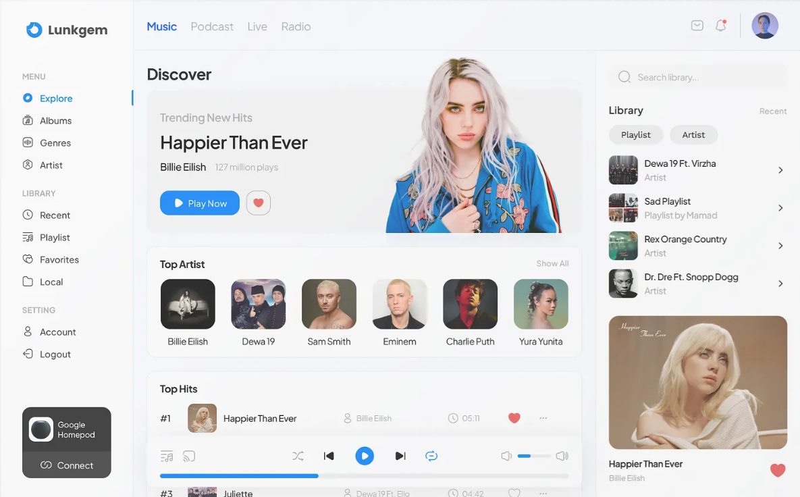

# KIMS

KIMS - Free royalty-free sound library for content creators.

KIMS is a web app for discovering music, sound effects, lofi tracks, and cinematic audio for creative projects. It is built for video editors, streamers, designers, and creators who need simple browsing, real playback, and organized listening tools.

## Features

- Browse music, SFX, lofi, and cinematic tracks
- Save favorites, playlists, and listening history
- Play real audio with waveform previews
- Register, log in, and recover forgotten passwords

## Tech Stack

- Frontend: Next.js, TypeScript, Tailwind
- Backend: Go, Chi, PostgreSQL
- Storage: Supabase
- Deployment: Vercel

## Screenshots



## Getting Started

Clone the repository:

```bash
git clone <repository-url>
cd kims
```

Install frontend dependencies:

```bash
npm install
```

Copy environment examples:

```bash
cp apps/web/.env.example apps/web/.env
cp apps/api/.env.example apps/api/.env
```

Run database migrations:

```bash
cd apps/api
go run ./cmd/migrate
```

Start the frontend dev server:

```bash
cd ../..
npm run web:dev
```

Start the API server:

```bash
cd apps/api
go run ./cmd/api
```

## Project Structure

```text
kims/
  README.md
  package.json
  package-lock.json
  apps/
    web/
      src/
      public/
    api/
      cmd/
      internal/
      migrations/
  scripts/
```

## License

MIT

## Contact

Author: KIMS
